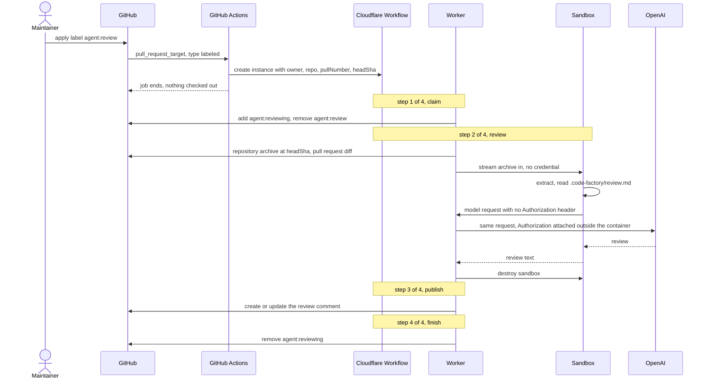
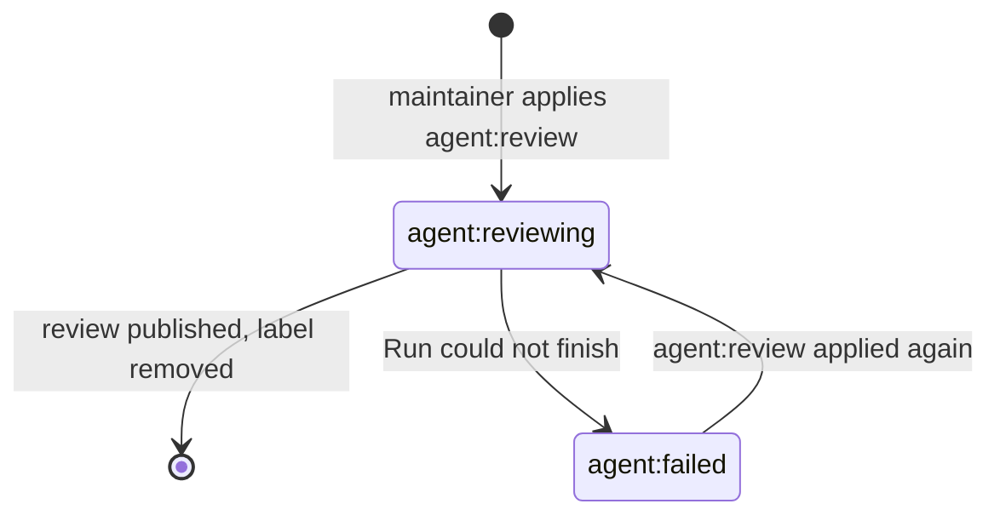

# Code Factory

The Code Factory reviews pull requests. It checks out the exact head revision
in an isolated sandbox, reviews the change with a coding agent, and posts the
result as one comment.

You run it in your own Cloudflare account. This project operates no service and
holds none of your credentials or code.

## How a review runs

A maintainer applies the `agent:review` label. Applying a label needs write
access, so only trusted people can start a Run.



Three things that diagram is drawn to show.

GitHub Actions forwards four fields and exits. It never checks out pull-request
code, so `pull_request_target` exposes no secret to a fork.

The sandbox never talks to GitHub. The Worker fetches the archive and streams it
in, so no GitHub credential exists inside the container.

The model credential is attached after the request leaves the container. The
agent is configured to send none, and the container can reach exactly one host.

## Prerequisites

Install these before you start:

| Tool                  | Needed for | Notes                                                      |
| --------------------- | ---------- | ---------------------------------------------------------- |
| OpenTofu or Terraform | step 2     | Commands say `tofu`. `terraform` takes the same arguments. |
| Node and pnpm         | step 3     | Versions are pinned in [`package.json`](package.json).     |
| Docker, running       | step 3     | `wrangler deploy` builds the sandbox image with it.        |
| GitHub CLI            | step 4     | Only `scripts/enable-repo.sh` uses it.                     |

You also need a Cloudflare **Workers Paid** plan. Containers require it, and every
review runs one. There is no separate toggle to switch Containers on. The plan is
$5 per month and includes a monthly allotment of memory, CPU, disk, and egress;
past that you pay per second. See
[Containers pricing](https://developers.cloudflare.com/containers/pricing/).

## 1. Collect four values

Keep these somewhere you can paste from. Steps 2 to 4 ask for all of them.

### Cloudflare account id

Open <https://dash.cloudflare.com>, press `Cmd/Ctrl + K`, type `Copy account ID`,
and select the result.

Already have Wrangler working? `pnpm dlx wrangler whoami` prints it too.

### Cloudflare API token, for Terraform

<https://dash.cloudflare.com/profile/api-tokens> → **Create Token** → **Custom
token** → **Get started**. No template covers Secrets Store.

Under **Permissions** add two rows, both with the first dropdown set to
**Account**:

| Resource      | Access |
| ------------- | ------ |
| Secrets Store | Read   |
| Secrets Store | Edit   |

`Edit` is Cloudflare's name for write. Set **Account Resources** to your account,
then **Continue to summary** → **Create Token**. Copy it now; the dashboard shows
it once.

### Cloudflare API token, for GitHub Actions

Create a second token the same way. This one only starts Workflow runs, so give
it less:

| Resource        | Access |
| --------------- | ------ |
| Workers Scripts | Edit   |

There is no dropdown entry called `Workers Scripts: Write`. The resource is
**Workers Scripts** and the write level is **Edit**. The **Edit Cloudflare
Workers** template also works.

### GitHub token

<https://github.com/settings/personal-access-tokens/new>

- **Repository access** → **Only select repositories** → pick every repository you
  want reviewed.
- **Permissions** → **Repository permissions** → **Pull requests** → **Read and
  write**. GitHub adds **Metadata: Read-only** for you.
- **Expiration** goes up to 366 days, or no expiry.

### OpenAI API key

<https://platform.openai.com/api-keys>. A platform key, not a ChatGPT
subscription. [`docs/research/codex-cli-authentication.md`](docs/research/codex-cli-authentication.md)
explains why a subscription cannot work here.

## 2. Create the secrets

The Terraform module in [`infra/`](infra/) puts your GitHub token and model key
into Cloudflare Secrets Store.

```bash
cd infra
tofu init
tofu apply
```

OpenTofu asks for each value, so nothing lands on disk or in your shell history:

| Prompt           | Paste                           |
| ---------------- | ------------------------------- |
| `api_token`      | the Terraform token from step 1 |
| `account_id`     | your account id                 |
| `github_token`   | the GitHub token                |
| `openai_api_key` | your OpenAI key                 |

To stop retyping them, put the same names in `infra/terraform.tfvars`. Both tools
read that file, and it is gitignored.

Cloudflare allows one Secrets Store per account. The module reuses the store you
already have and creates one only if you have none.

Keep the `secrets_store_id` it prints.

## 3. Deploy the Worker

Terraform cannot deploy this Worker. The Cloudflare provider's `containers`
attribute accepts only a Durable Object class name, so it can neither build nor
push a container image. Wrangler does that step, and it owns nothing Terraform
owns. See [ADR 0004](docs/adr/0004-terraform-provisioning.md).

Put the `secrets_store_id` from step 2 into **both** `store_id` fields of
`apps/review-worker/wrangler.jsonc`.

Start Docker, then:

```bash
pnpm install
pnpm -C apps/review-worker exec wrangler login
pnpm -C apps/review-worker exec wrangler deploy
```

`wrangler login` opens your browser and stores an OAuth token, which already
carries every permission the deploy needs. The first deploy takes a few minutes
because it builds and pushes the container image.

Prefer a token to the browser? Set `CLOUDFLARE_API_TOKEN` and
`CLOUDFLARE_ACCOUNT_ID` and skip `wrangler login`. That token needs **Workers
Scripts: Edit** _and_ **Secrets Store: Edit**, because the Worker binds a secret
and a read-only token fails at deploy time.

## 4. Turn it on for a repository

Steps 1 to 3 happen once for your whole account. This step repeats per
repository.

```bash
./scripts/enable-repo.sh --token cf_xxx --account 1a2b3c octocorp/app
```

`--token` is the **GitHub Actions** token from step 1, not the Terraform one.

The script creates the `agent:review`, `agent:reviewing` and `agent:failed`
labels, sets both repository secrets, and commits the workflow file. Running it
again on the same repository is safe.

A token on the command line is visible to other processes and lands in your shell
history. Use a throwaway token, or prefix the command with a space where your
shell skips those.

### Which version your repositories follow

`uses:` takes a branch, a release tag, or a commit SHA. There is no `@latest`
keyword.

The default is `@main`, so your repositories pick up fixes as soon as they land
and no tag has to be moved. Pin to a tag or a SHA once the capability settles,
or straight away if you do not control this repository. Pass `--ref` to choose:

```bash
./scripts/enable-repo.sh --token cf_xxx --account 1a2b3c \
  --ref jd-solanki/cloudfactory@v1 octocorp/app
```

Now open a pull request and apply the `agent:review` label. The label flips to
`agent:reviewing` within a few seconds, and the review arrives as a comment.

To set it up by hand instead: create those three labels, add the two secrets, and
commit this file.

```yaml
# .github/workflows/agent-review.yml
on:
  pull_request_target:
    types: [labeled]

jobs:
  review:
    uses: jd-solanki/cloudfactory/.github/workflows/review.yml@main
    secrets: inherit
```

## Labels

| Label             | Meaning                                                      |
| ----------------- | ------------------------------------------------------------ |
| `agent:review`    | You are asking for a review. A Run consumes this label.      |
| `agent:reviewing` | A Run owns this pull request right now.                      |
| `agent:failed`    | The Run could not finish. Apply `agent:review` to try again. |

No label after a review means it finished. The comment carries the outcome.



A pull request carries at most one `agent:*` label, and every label this
capability does not own is left alone.

## Troubleshooting

**`terraform: command not found`** — you have OpenTofu. Use `tofu`.

**`maximum_stores_exceeded`** — an old version of the module tried to create a
second Secrets Store. Pull the latest and run `tofu apply` again.

**`wrangler deploy` fails on the container build** — Docker is not running.

**The Workflow errors with `payload is not an object`** — your repository is
pinned to an old version of the reusable workflow. Move the `uses:` line to
`@main`.

**A code change did not take effect** — the reusable workflow ref only controls
the GitHub Action. Worker or `packages/core` changes need
`wrangler deploy` again. The container image is rebuilt only when the
Dockerfile changes.

## Many projects

One deployment serves every repository. Nothing in the Worker is tied to a
single project, so steps 1 to 3 never repeat.

```bash
./scripts/enable-repo.sh --token cf_xxx --account 1a2b3c \
  john/dotfiles john/personal-website octocorp/app
```

### The GitHub token must cover all of them

It is one fine-grained token, given to Terraform in step 2. Select every
repository you want reviewed, and only those.

### Secrets can live at the organization level

If your projects sit in a GitHub organization, set `CLOUDFLARE_API_TOKEN` and
`CLOUDFLARE_ACCOUNT_ID` once as organization secrets. The script then has
nothing to set per repository.

### Five reviews run at once

`max_instances` in `apps/review-worker/wrangler.jsonc` caps concurrent
containers across every project. The sixth review waits for a free slot.

## Configure the review

A reviewed repository owns its own review rules in `.code-factory/review.md`.
The sandbox reads that file from the checkout. A repository without the file
gets the default instructions in
[`packages/core/src/review-instructions.ts`](packages/core/src/review-instructions.ts).

## Where credentials live

The review container holds no credential.

| Credential           | Held by                        | Never reaches             |
| -------------------- | ------------------------------ | ------------------------- |
| Cloudflare API token | GitHub Actions                 | the Worker, the container |
| GitHub token         | the Worker, from Secrets Store | the container             |
| Model API key        | the Worker, from Secrets Store | the container             |

The Worker fetches the repository and streams it into the sandbox, so the
sandbox never talks to GitHub. The reviewing agent sends model requests with no
credential, and the Worker attaches one after the request leaves the container.
The container can reach exactly one host and is destroyed when the Run ends.

One exception sits outside that boundary. Terraform records what it created, so
your GitHub token and model key end up in `infra/terraform.tfstate` in
plaintext. That file is gitignored. Treat it as a secret, or move the module to
a remote backend that encrypts state. The Cloudflare API token is not affected;
it configures the provider rather than a resource, so it never enters state.

## Layout

```text
.github/workflows/review.yml   the reusable workflow other repositories call
infra/                         Terraform module for secrets
scripts/enable-repo.sh         turns on reviews for one repository
packages/core/                 capability logic, no Cloudflare imports
apps/review-worker/            Worker, Workflow, and sandbox
docs/                          decisions, capability specification, research
```

## Development

```bash
pnpm run ready   # format, lint, typecheck, test, build
```
